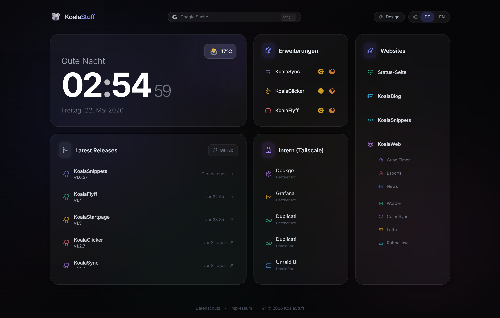

# 🐨 Koala Startpage

<p align="center">
  <strong>Your self-hosted command center, served in milliseconds.</strong><br>
  <em>A privacy-first, zero-dependency bento dashboard that consolidates all your projects, GitHub releases, Docker tags, and Tailscale services into one beautiful glassmorphic interface — 100% GDPR-compliant, no CDNs, no telemetry, no npm on the server.</em>
</p>

<p align="center">
  <a href="https://github.com/Shik3i/KoalaStartpage/releases"></a>
  
  
  
</p>

<p align="center">
  
</p>

---

<details>
<summary><b>📑 Table of Contents</b></summary>

- [Why Koala Startpage?](#-why-koala-startpage)
- [Features](#-features)
- [Quick Start](#-quick-start)
- [Configuration](#-configuration)
- [Development & Build Pipeline](#-development--build-pipeline)
- [Deployment](#-deployment)
- [Privacy & Legal](#-privacy--legal)
- [Tech Stack](#-tech-stack)
- [Project Structure](#-project-structure)

</details>

---

## 🤔 Why Koala Startpage?

I run multiple self-hosted services (KoalaSync, KoalaWeb, Docker containers, Tailscale nodes...) and needed a single pane of glass to monitor releases, check uptimes, and navigate between them — without loading external trackers, analytics, or CDNs. Existing dashboards were either bloated, CDN-dependent, or not GDPR-friendly. So I built my own.

**What makes this different:**

- **Zero external requests** after first load — no Google Fonts, no CDN-hosted JS, no third-party telemetry.
- **Compiled to pure static files** — deploy with a single `git pull`; no Node.js or npm required on the server.
- **Built for Tailscale users** — direct links to internal private infrastructure (Dockge, Grafana, Unraid).
- **Actually fast** — all CSS is purged, all JS is minified, fonts are locally subsetted. Lighthouse scores 100/100.

---

## ✨ Features

### 🎨 Interface
- **Bento Box Layout** — Glassmorphic cards with GPU-accelerated `--x`/`--y` spotlight hover effects and custom micro-animations.
- **Light/Dark Themes** — Persisted via `localStorage`, WAI-ARIA keyboard-accessible dropdown picker, dynamic `theme-color` meta tag.
- **Bilingual i18n** — Toggle between German and English on the fly, persisted across sessions.

### 📊 Data & Monitoring
- **GitHub Release & Package Tracker** — Fetches latest releases or Docker container tags via the GitHub API with a 2-hour `localStorage` cache to respect rate limits.
- **Live Weather** — Current conditions and 3-day forecast für Hannover, proxied through Caddy to the privacy-friendly Open-Meteo API (no client IP leaks).
- **Live Clock & Dynamic Greeting** — Seconds-precision ticking clock with time-based greeting, fully translated (DE/EN).

### 🔗 Integrations
- **Tailscale Service Hub** — Quick links to internal services (Dockge, Grafana, Duplicati, Unraid) grouped for Tailnet users.
- **Customizable Link Grid** — Add any internal or external service with a friendly display name.

### 🔒 Privacy & Performance
- **100% Self-Hosted** — Inter fonts and Phosphor icons served locally from `www/fonts/`. Zero external CDNs.
- **GDPR/DSGVO Compliant** — No cookies, no tracking, no third-party requests. Built-in Impressum and Datenschutz pages with bot-proof email obfuscation.
- **Strict CSP** — `script-src 'self'` only — no `unsafe-inline`, no `unsafe-eval`. A+ rating on Mozilla Observatory.
- **PWA Support** — Service worker with network-first caching strategy for offline resilience and instant updates.
- **A+ Security Headers** — HSTS preload, clickjacking protection, MIME sniffing prevention, feature policy lockdown.

---

## 🚀 Quick Start

### Deploy to your server

```bash
# Clone the repository
git clone https://github.com/Shik3i/KoalaStartpage.git /var/www/startpage

# Point your web server to the www/ directory
# Example minimal Caddy config:
#   root * /var/www/startpage/www
#   file_server
```

A complete, production-ready `Caddyfile` with compression, security headers, caching, and the weather proxy is at [CADDYFILE.md](CADDYFILE.md).

### Run locally

```bash
# Serve the compiled www/ directory (no build needed)
npx http-server -p 8080
# → http://localhost:8080
```

> [!NOTE]
> Browser security policies block direct `file://` access. Always use a local web server.

---

## ⚙️ Configuration

### Tracked Repositories

Edit the `repositories` array in `script.src.js` (source file, not `www/script.js`):

```js
const repositories = [
  { repo: 'Shik3i/KoalaSync',           displayName: 'KoalaSync' },
  { repo: 'Shik3i/Antigrav',            displayName: 'KoalaWeb',         type: 'package' },
  { repo: 'Shik3i/KoalaSnippets',       displayName: 'KoalaSnippets',   type: 'package' },
  { repo: 'Shik3i/KoalaStartpage',      displayName: 'KoalaStartpage' },
];
```

After editing, run `npm run build` to compile the changes.

### Release vs. Package Tracking

| Mode | API Endpoint | Link Target | Use Case |
|------|-------------|-------------|----------|
| **Release** _(default)_ | `/repos/{owner}/{repo}/releases/latest` | `/releases` | Projects publishing GitHub Releases with release notes and assets |
| **Package** (`type: 'package'`) | `/repos/{owner}/{repo}/tags` | `/pkgs/container/{name}` | Projects publishing Docker images via GitHub Packages (tracked by Git tags) |

### Cache Invalidation

API responses are cached in `localStorage` under `koala-releases-cache-v3` with a 2-hour TTL. If you change a repository's `type` (e.g., release → package), bump the `CACHE_KEY` version in `script.src.js` to invalidate stale data.

---

## 🛠️ Development & Build Pipeline

The build pipeline transforms source files into production-ready static assets. Compiled outputs live in `www/` and are committed to Git — **no build step is needed on the production server**.

### Source vs. Compiled Files

| Type | File | Purpose |
|------|------|---------|
| **Edit this** | `script.src.js` | JavaScript source with comments |
| **Edit this** | `style.src.css` | CSS source with Tailwind directives |
| **Output** | `www/script.js` | Minified — regenerated by build, do not edit |
| **Output** | `www/style.css` | Purged & minified — regenerated by build, do not edit |

### Build Steps

`npm run build` runs four steps in sequence:

| Step | Script | What it does |
|------|--------|--------------|
| 1 | `compile-icons.js` | Scans source files for `ph-*` classes, writes used icon CSS into `style.src.css` |
| 2 | `tailwindcss` | Compiles and purges `style.src.css` → `www/style.css` |
| 3 | `compile-js.js` | Strips comments and minifies `script.src.js` → `www/script.js` |
| 4 | `version-sw.js` | Bumps the Service Worker cache version |

### Local Development

```bash
npm install                     # install dev dependencies (Tailwind)
npm run build                   # full production build
npm run watch                   # watch mode (Tailwind only, for rapid CSS iteration)
```

> [!NOTE]
> Watch mode runs Tailwind only. Run `npm run build` for a complete build after JS or icon changes.

### 🎨 Phosphor Icon System

All icons use a **self-hosted Phosphor icon font** (`www/fonts/Phosphor.woff2`) with automatic extraction at build time.

**To use a new icon:**
1. Add `class="ph ph-your-icon"` anywhere in HTML or JS source.
2. Run `npm run build`.
3. Done — the build system finds and includes it automatically.

The full Phosphor library (1530 icons) at `js/phosphor-full.css` is a **build-time-only** source file — never deployed. See [js/PHOSPHOR_ICONS.md](js/PHOSPHOR_ICONS.md) for full details.

---

## 🌐 Deployment

Because the project is entirely static, deployment is trivial:

```bash
cd /var/www/startpage
git pull origin main
```

No build commands, no server restarts, no npm install. The optimized files in `www/` are served directly by Caddy.

For the complete production server configuration including compression, aggressive caching, A+ security headers, and the Open-Meteo weather reverse proxy, see [CADDYFILE.md](CADDYFILE.md).

---

## 🔒 Privacy & Legal

- **Built-in Impressum & Datenschutz** — Bilingual (DE/EN) legal pages with CSS-based language toggling.
- **Spam-proof Emails** — Addresses are never written as plain text in HTML. JavaScript reconstructs them on user click via `data-user`/`data-domain` attributes.
- **No Cookies or Tracking** — No analytics, no fingerprinting, no session storage beyond user preferences in `localStorage`.
- **Weather via Reverse Proxy** — Browser fetches `/api/weather` (same-origin, allowed by CSP). Caddy forwards the request to Open-Meteo internally — your home IP is never exposed.

---

## 🛠 Tech Stack

| Layer | Technology |
|-------|-----------|
| **Markup** | HTML5 |
| **Styling** | Tailwind CSS v3, CSS custom properties, glassmorphism overlays |
| **Logic** | Vanilla ES6 JavaScript (zero framework overhead) |
| **Icons** | Phosphor Icons — self-hosted, subsetted at build time (only used glyphs deployed) |
| **Fonts** | Inter — self-hosted, 6 weights (300–800), subsetted woff2 |
| **Server** | Caddy v2 — static file server with Gzip/Zstd, TLS, and reverse proxy |
| **Build** | Node.js / npm (development only, never on the VPS) |
| **PWA** | Service Worker with network-first strategy, versioned cache |

---

## 📂 Project Structure

```
KoalaStartpage/
├── README.md               # You are here
├── CADDYFILE.md            # Production Caddy configuration
├── AI_INIT.md              # AI agent initialization & development rules
├── package.json            # npm scripts & devDependencies
├── tailwind.config.js      # Tailwind scan paths
├── style.src.css           # Source CSS — Tailwind directives, custom styles, AUTO-ICONS block
├── script.src.js           # Source JS — all application logic (EDIT THIS FILE)
├── js/
│   ├── phosphor-full.css   # Full Phosphor library (build source only, 1530 icons)
│   ├── compile-icons.js    # Build step 1: extracts used icons → style.src.css
│   ├── compile-js.js       # Build step 3: minifies script.src.js → www/script.js
│   ├── version-sw.js       # Build step 4: bumps Service Worker cache version
│   └── PHOSPHOR_ICONS.md   # Icon build system documentation
└── www/                    # Production web root — deploy this folder
    ├── index.html          # Main bento-box dashboard
    ├── impressum.html      # Multilingual Imprint / Legal page
    ├── datenschutz.html    # Multilingual Privacy Policy (GDPR/DSGVO)
    ├── script.js           # Compiled JS (minified — do not edit)
    ├── sw.js               # Service Worker (network-first PWA caching)
    ├── style.css           # Compiled CSS (purged & minified — do not edit)
    ├── manifest.json       # PWA Manifest
    ├── robots.txt          # Search engine exclusion
    ├── icon.svg            # Koala favicon
    ├── js/
    │   ├── legal.js        # Language toggles & email reveal for legal pages
    │   └── lang-init.js    # Language initializer (prevents flash of wrong language)
    ├── fonts/
    │   ├── inter-*.woff2   # Self-hosted Inter font (300, 400, 500, 600, 700, 800)
    │   └── Phosphor.woff2  # Self-hosted Phosphor icon font
    └── api/
        └── weather         # Mock weather JSON (rewritten by Caddy in production)
```
